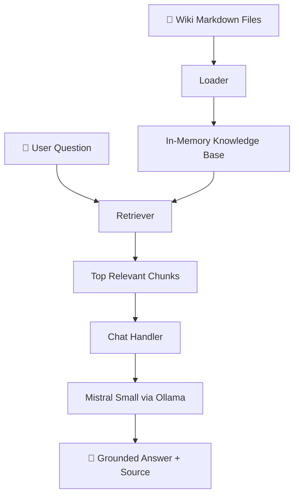

# 🤖 Wiki Chatbot

A fully local, fully free AI chatbot that answers questions using an internal wiki as its knowledge base — no API keys, no cloud, no cost.

Built as part of my **DataByDon** learn-with-me series. Follow along at [@databydon](https://x.com/databydon).

---

## 💡 What is this?

This is a **RAG (Retrieval Augmented Generation)** chatbot. Instead of relying on what the LLM already knows, it:

1. Loads your internal wiki (Markdown files)
2. Finds the most relevant pages for your question
3. Injects that content into the prompt
4. Returns a grounded answer with a source citation

The result? An LLM that only answers from *your* content.

---

## 🛠️ Tech Stack

| Layer | Tool |
|---|---|
| LLM | [Mistral Small](https://mistral.ai/) via [Ollama](https://ollama.com/) |
| Backend | [FastAPI](https://fastapi.tiangolo.com/) + [Uvicorn](https://www.uvicorn.org/) |
| Wiki format | Markdown files |
| Retrieval | Keyword scoring (no embeddings needed) |
| Frontend | Vanilla HTML/CSS/JS |

> 100% open source. Runs entirely on your laptop.

---

## 🚀 How to Run It

### 1. Clone the repo
```bash
git clone https://github.com/DatabyDon/wiki-chatbot.git
cd wiki-chatbot
```

### 2. Set up your virtual environment
```bash
python -m venv .venv
.venv\Scripts\activate  # Windows
pip install -r requirements.txt
```

### 3. Install Ollama and pull Mistral
Download Ollama from [ollama.com](https://ollama.com), then run:
```bash
ollama pull mistral-small
```

### 4. Start the server
```bash
uvicorn main:app --reload
```

### 5. Open the chat UI
Go to **http://localhost:8000** in your browser and start asking questions.

---

## 📁 Project Structure

wiki-chatbot/
├── wiki/ # Your Markdown knowledge base
├── src/
│ ├── loader.py # Reads and loads wiki files
│ ├── retriever.py # Finds relevant chunks for a query
│ └── chat.py # Calls Mistral with context injected
├── static/
│ └── index.html # Chat UI
├── main.py # FastAPI server
└── requirements.txt
---

## 🧠 How RAG Works

Think of it like an open-book exam:
- 📂 **Loader** = organizing your notes before the exam
- 🔍 **Retriever** = finding the right page when a question comes up
- 🤖 **Mistral** = reading those notes and writing the answer

The LLM never "knows" your wiki — it just gets the relevant pages pasted into the prompt every time.

---

## 🗺️ Architecture



## 📌 What's Next

This is **Module 1** of an ongoing series building enterprise AI capabilities with free and open source tools. More modules coming soon.

Follow the journey → [@databydon](https://x.com/databydon) on X and YouTube.

---

*Built with curiosity, Claude, and zero budget.* 🔥